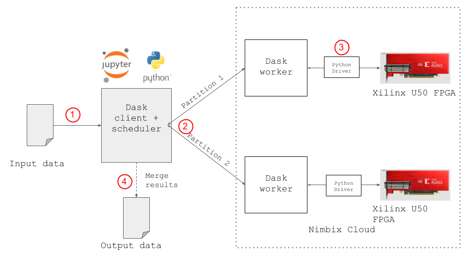

# Octoray

In this repo, we demonstrate 2 examples of using Dask (https://github.com/dask/dask) to parallelise data analytics using multiple U50 FPGAs.


## General architecture:



The idea is based on the principle of data parallelism. It works by splitting the input data payload into as many chunks as the number of available FPGAs, and performing the computation in parallel. The results are then combined into a single output object.


Assuming a Dask cluster is already set up, the steps involved to parallise any task are:
1. A dask client reads the input data (from a file,socket etc.).

2. The client detects the number of workers in the cluster. It splits the input data, and scatters the chunks to the workers.

3. Each worker uses a Python Driver (a Pynq Overlay/custom driver) to send the data to the FPGA, and wait for the results. The results are then returned to the client.

4. The client, after receiving all the results, combines them, and emits the final output.


## Setting up  a dask cluster
This consists of two steps:
1. Starting a `dask scheduler`. This is a Python process which is responsible for scheduling tasks on the worker, and maintaining application state.

```$ dask-scheduler```

This emits an IP address, which can be used to register Dask clients and workers.

2. Starting one or more `dask workers`. These are Python processes which perform the actual computation. These can be present on the the same machine as the scheduler or remote ones. We can spawn as many workers as the number of available FPGAs

```$ dask-worker <IP_OF_SCHEDULER> --nthreads 1 --memory-limit 0 --no-nanny```

## Examples
1. GZIP accleration using Vitis Data Compression Library
2. CNV accelration using FINN (`cnv_w1a1_u50/`)
