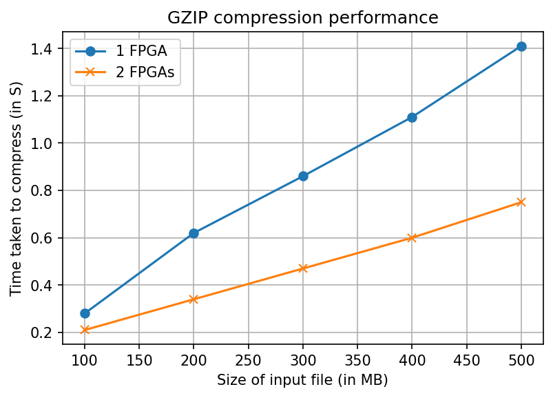
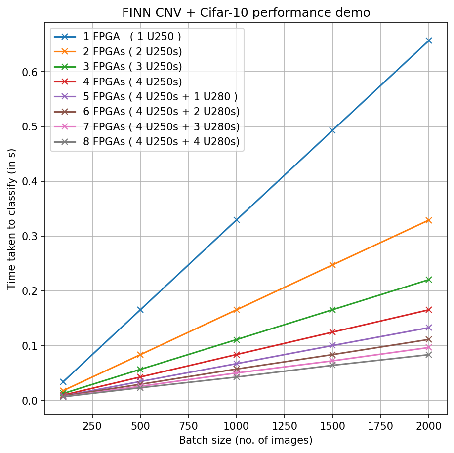

# OctoRay

In this repo, we demonstrate 2 examples of using Dask (https://github.com/dask/dask) to parallelize data analytics on multiple U50 FPGAs.


## General architecture:


The idea is based on the principle of data parallelism. It works by splitting the input data payload into as many chunks as the number of available FPGAs and performing the computation in parallel. The results are then combined into a single output object.


Assuming a Dask cluster is already set up, the steps involved to parallelize any task are:
1. A Dask client reads the input data (from a file, socket, etc.).

2. The client detects the number of workers in the cluster. It splits the input data and scatters the chunks to the workers.

3. Each worker uses a Python Driver (a Pynq Overlay/custom driver) to send the data to the FPGA, and wait for the results. The results are then returned to the client.

4. The client, after receiving all the results, combines them and emits the final output.

## Advantages

1. This architecture can be used in both setups - one host with multiple attached FPGAs, or multiple (remotely connected) hosts each with their own FPGA. Several Dask workers can be spawned on the same or different machines, and each is associated to one FPGA. Any number of FPGAs may be connected this way, and we will observe speedup as long as the network is not saturated.

2. Different types of kernels/accelerators can be used. For example, kernels built using Vitis libraries, FINN, or other custom kernels can be used as long as a Python interface to them is available. In this project, we have used a Vitis library kernel and a FINN kernel, and written Python drivers for these. Also, any accelerator built for a PYNQ-supported platform can be used.

3. Since we use popular Python libraries (Dask, Numpy, etc.), this makes the system hardware agnostic. As long as we can compile an accelerator for the available hardware platform, the system can be deployed on that platform. We have run this setup on various hardware platforms such as Pynq-Z1 boards, AWS F1 instances, Nimbix cloud instances, and our in-house Alveo servers.


## Setting up  a Dask cluster
This consists of two steps:
1. Starting a `dask scheduler`. This is a Python process which is responsible for scheduling tasks on the worker and maintaining the application state.

```$ dask-scheduler```

This emits an IP address, which can be used to register Dask clients and workers.

2. Starting one or more `dask workers`. These are Python processes that perform the actual computation. These can be present on the same machine as the scheduler or remote ones. We can spawn as many workers as the number of available FPGAs

```$ dask-worker <IP_OF_SCHEDULER> --nthreads 1 --memory-limit 0 --no-nanny```

## Examples

### 1. **`gzip_compression`**  (GZIP accleration using Vitis Data Compression Library)

From the man page of gzip (https://linux.die.net/man/1/gzip):  `Multiple compressed files can be concatenated. In this case, gunzip will extract all members at once.`

Hence, the concatenation of several gzip files is also a valid gzip file. We use this principle to split up the input uncompressed file into 2 parts, compress these parts separately, and then concatenate them.

The following plot shows the acceleration achieved on using 2 U50 FPGAs to compress files of various sizes. 
In both cases, the Dask client and the workers were located on separate machines in the Nimbix cloud. The time shown is the time taken to compress the entire input file. It does NOT include the network I/O time taken to transmit data between the client and the worker(s).





Using 2 FPGAs in parallel resulted in a **speedup of ~2x** for all input sizes.
### Comparision to software baseline:
This setup is faster than a purely software (SW) implementation. The below table shows the throughput benchmarks (in MBps) between FPGA and software-based compression. For the software benchmarks, we used 2 tools:
1. Linux's inbuilt `gzip` tool (lowest compression level - fastest)
2. `pigz` tool - A multiprocessor implementation of gzip (lowest compression level - fastest) (https://zlib.net/pigz/)

The machine used is a 2.7 GHz Dual-Core Intel Core i5 processor.


 `gzip` SW throughput | `pigz` SW throughput | Dask 1 worker | Dask 2 workers
------------ | ------------- | ------------- | ------------- 
24.3 | 40.6 | 348.3 |  627.8 

(Units: MBps)

The 2-FPGA implementation is about **15 times** faster than a parallalised software implementation.

---
### 2. **`cnv_w1a1_u50`** (CNV acceleration using FINN)
In this example, the FINN library was used to build a binarized convolutional network for the U50 FPGA. The CNV-W1A1 network is used to classify a 32x32 RGB image to one of CIFAR-10 dataset's classes. The bitstream was generated with the help of the test cases here - https://github.com/Xilinx/finn/blob/master/tests/end2end/test_end2end_bnn_pynq.py.


Once the accelerator is built, we can use data parallelism to improve the speed of inference. In our setup, we split the test dataset into 8 parts and used 8 accelerators from ETH's XACC cluster to classify these parts in parallel. As a result, a **speedup of 8x** was observed in the classification time (inference time + data copying time to/from the FPGA) when compared to using just 1 FPGA.



### Comparision to software baseline:
This setup is also faster than a purely software (SW) implementation. A pretained version of the same network (CNV-W1A1) from Xilinx's Brevitas (https://github.com/Xilinx/brevitas/tree/master/brevitas_examples/bnn_pynq) framework was used as a software baseline.

The machine used is a 2.7 GHz Dual-Core Intel Core i5 processor (no GPU).

The table below shows the throughput values for the networks:
 `brevitas` SW model |  Dask 1 worker | Dask 2 workers
------------ | ------------- | ------------- 
232.56 | 2944.96 | 5709.42

(Units: images/second)

The 2-FPGA implementation is almost **24 times** faster than a software implementation of the same neural network running on a CPU.
